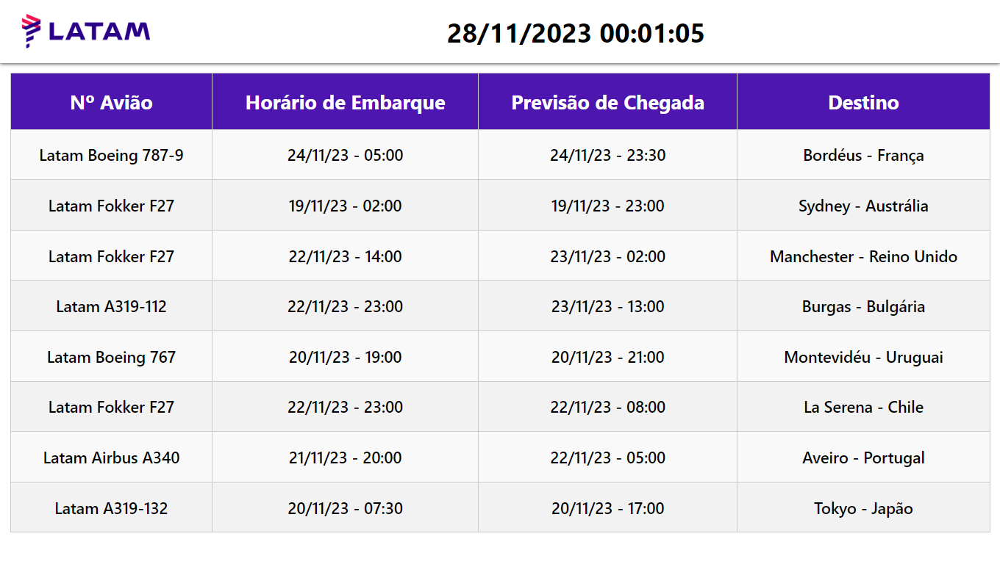

<h1 align="center">
 
   
 Painel aeroportuário
</h1>

  	

  <!-- project description and menu -->
  

      Preview do painel desenvolvido
     
     
     
    <a 
      href="https://github.com/BrunoPequeno/Painel-Atendimento/issues">
      Report Bug
    </a>
    ·
    <a 
      href="https://github.com/BrunoPequeno/Painel-Atendimento/issues/new">
      Request Feature
  

## Sobre o projeto
- [x] Projeto realizado para a entrega de um trabalho acâdemico, com o intuito de explorarmos diferentes modos de desenvolvimento. O painel foi desenvolvido em Angular e conectado a uma base de dados no Firebase, permitindo flexibilidade, além de uma função para fazer a hora passar pegando exatamento o horário e a data atual, além da atualização dos dados automática a cada 10s. 

## Obs: 
O deploy da aplicação está indisponível devido a uma alteração nos modulos do node, mas após dowload basta rodar o "ng serve" que a aplicação estará disponível.
